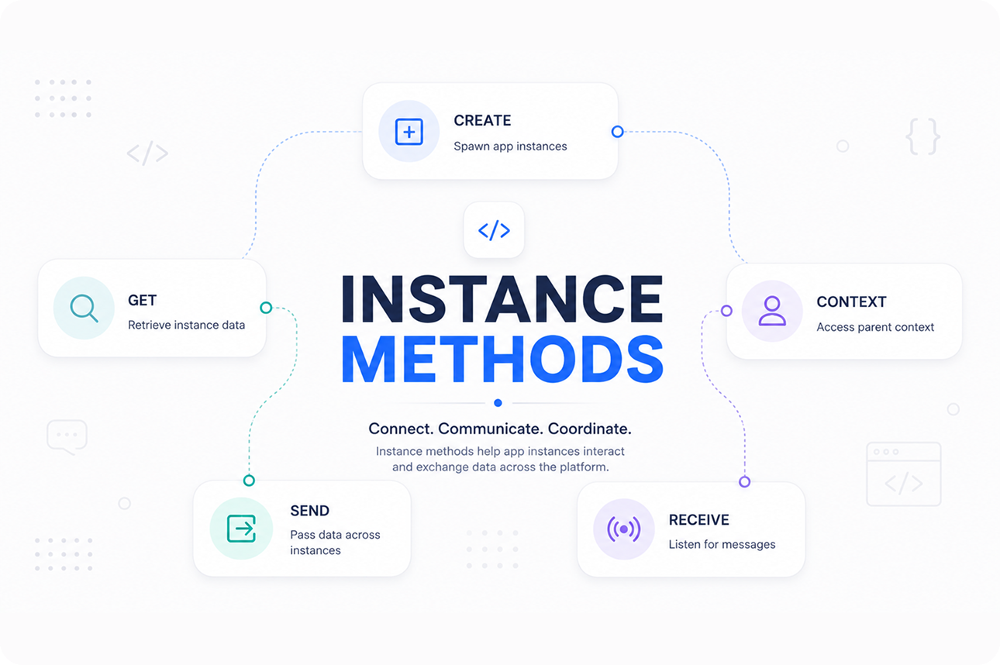

<p align="center">
  
</p>

# TechCorp Customer Health Dashboard

Freshdesk app for **TechCorp Solutions** that surfaces B2B **customer health scores** in the ticket sidebar and full-page app using Platform 3.0 **instance methods**.

## Description

TechCorp CSMs need account health tiers visible while working tickets. This app demonstrates parent/child instance coordination — modal health reviews, dialog escalation notes, and cross-instance messaging. See [`usecase.md`](usecase.md) for the full TechCorp operational scenarios.

### Core Functionality

1. **Health tier badge** — Healthy / At Risk / Critical in the ticket sidebar
2. **Modal workflow** — update assessment and notify the parent via `instance.send`
3. **Dialog escalation** — quick notes through `showDialog`
4. **Instance coordination** — `instance.resize`, `context`, and `receive` for multi-instance messaging

## Features

- Health tier badge (Healthy / At Risk / Critical) in the ticket sidebar
- Modal workflow to update assessment and notify the parent instance via `instance.send`
- Dialog for quick escalation notes
- `instance.resize`, `context`, and `receive` for multi-instance coordination

## User Interfaces

| Surface | Placement | Behavior |
| --- | --- | --- |
| `app/index.html` | `support_ticket.ticket_sidebar` | Health badge, open modal/dialog |
| `app/index.html` | `service_ticket.ticket_sidebar` | Same health UI on Freshservice |
| `app/index.html` | `common.full_page_app` | Portfolio health dashboard |
| `app/index.html` | `sales_account.sales_account_entity_menu` | Account-level health view |
| `app/index.html` | `chat_conversation.conversation_user_info` | Health context in chat |
| `app/modal.html` | Modal / dialog child instance | Health form; sends tier to parent |

## Platform 3.0 Features Used

### 1. Instance Methods — Parent / Child Coordination

```javascript
client.instance.resize({ height: '400px' });
client.instance.receive(function (event) { /* healthTier update */ });
childClient.instance.send({ message: { healthTier, notes } });
childClient.instance.close();
```

### 2. Interface Methods — Modal and Dialog

`client.interface.trigger('showModal', { template: 'modal.html', data: {...} })` opens the health review form. `showDialog` demonstrates a lighter escalation surface.

### 3. Multi-Module Placements

One codebase deploys across `support_ticket`, `service_ticket`, `sales_account`, `chat_conversation`, and `common.full_page_app`.

### 4. Crayons UI Components

The app uses Freshworks Crayons v4 design system:

| Component | Usage |
| --- | --- |
| `<fw-label>` | Health tier badge (color-coded) |
| `<fw-button>` | Open health review, escalation note, form actions |
| `<fw-form>` / `<fw-select>` | Modal health assessment form |
| `<fw-textarea>` | CSM notes in modal |

## Architecture

| Layer | Role |
|-------|------|
| `app/index.html` | Parent UI — badge + actions |
| `app/modal.html` | Child instance — health form |
| `app/scripts/app.js` | Instance API orchestration |

Placements: `full_page_app`, `ticket_sidebar` (support + service), `sales_account_entity_menu`, `conversation_user_info`.

## Project Structure

```
instance-method-samples/
├── app/
│   ├── index.html              # Parent — badge + modal/dialog triggers
│   ├── modal.html              # Child — health form + instance.send
│   ├── scripts/app.js
│   └── styles/
├── config/
│   └── iparams.json            # Empty — no install params required
├── manifest.json
├── usecase.md
└── README.md
```

## Prerequisites

- [Freshworks CLI (FDK)](https://developers.freshworks.com/docs/app-sdk/v3.0/support_ticket/basic-dev-tools/freshworks-cli/) v10.1.2 or later
- Node.js v24.x
- A Freshdesk trial account (Freshservice / Freshsales / chat surfaces optional)

Enable global apps before local development:

```bash
fdk config set global_apps.enabled true
```

## Setup

1. Install the app on your Freshdesk account.
2. No installation parameters required (`config/iparams.json` is empty).
3. Run locally:
   ```bash
   fdk validate
   fdk run
   ```
4. Open a ticket with `?dev=true` and use **Open health review** to test modal messaging.

## Implementation steps

1. **Parent load** — On `app.activated`, call `instance.resize` and subscribe to `instance.receive`.
2. **Show modal** — `client.interface.trigger('showModal', { template: 'modal.html', data: {...} })`.
3. **Child submit** — Child calls `instance.send({ message: { healthTier, notes } })` then `instance.close()`.
4. **Parent update** — `receive` handler reads `healthTier` and updates the Crayons label.

## Toolchain

- Platform **3.0**
- Node **24.11.1** · FDK **10.1.2**

## Testing

```bash
fdk validate
```

Reset local state when re-testing instance messaging:

```bash
rm .fdk/store.sqlite
fdk run
```

## Key Learnings

1. **Child closes itself** — call `instance.close()` after `instance.send` so the parent regains focus.
2. **Subscribe on activate** — register `instance.receive` inside `instance.context()` so the handler knows its instance ID.
3. **Modal vs dialog** — `showModal` for full forms; `showDialog` for lightweight prompts sharing the same template.
4. **Resize both instances** — parent sidebar and child modal may need separate `instance.resize` calls.

## Resources

- [Instance methods](https://developers.freshworks.com/docs/app-sdk/v3.0/support_ticket/front-end-apps/instance-methods/)
- [Interface methods — showModal / showDialog](https://developers.freshworks.com/docs/app-sdk/v3.0/support_ticket/front-end-apps/interface-methods/)
- [App locations](https://developers.freshworks.com/docs/app-sdk/v3.0/support_ticket/front-end-apps/app-locations/)

See [usecase.md](./usecase.md) for industry scenarios.
